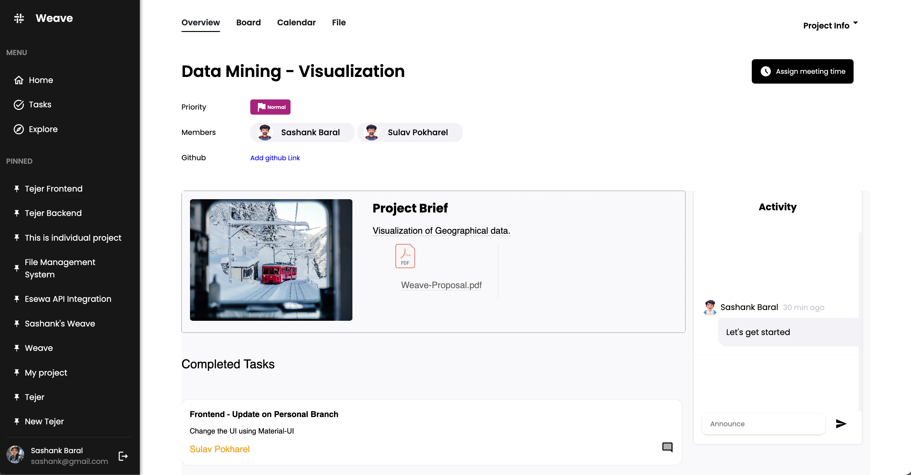
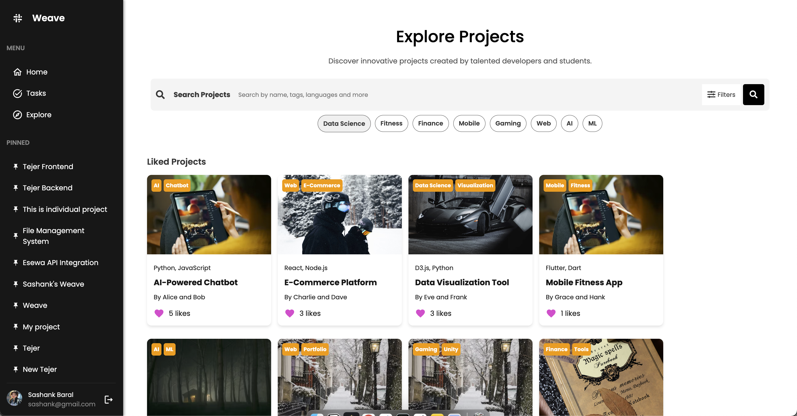
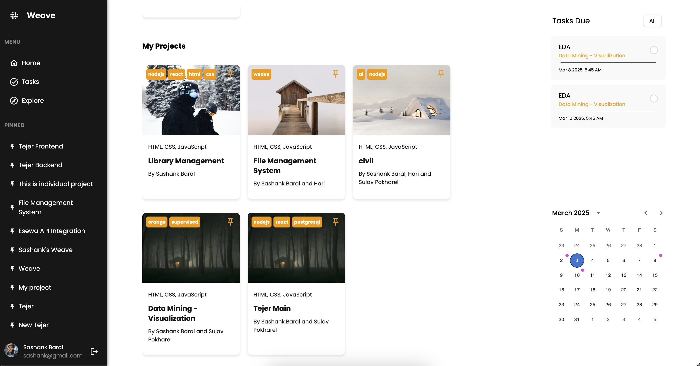
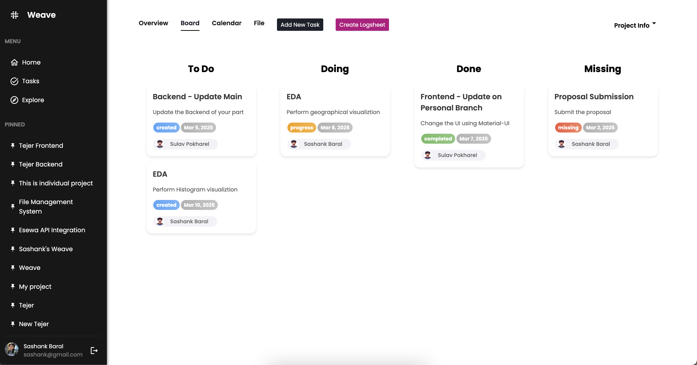
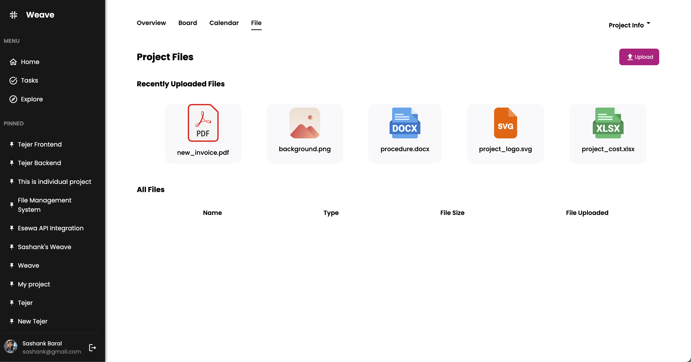
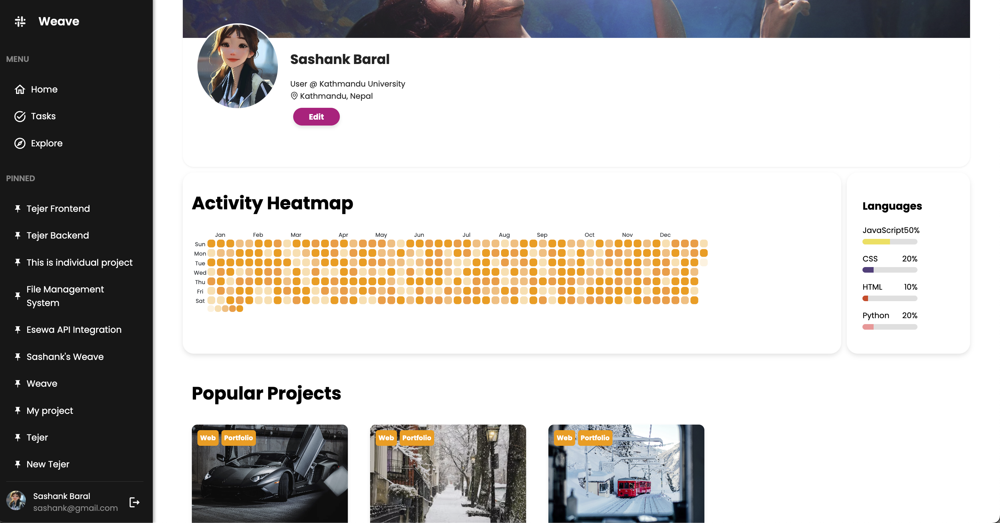

# **Weave-React-NodeJS**
  
  
  

**Weave** is a dynamic web application built using **React**, **Node.js**, and **PostgreSQL**, hosted on **Azure**. It offers a seamless workflow for organizations and users, combining intuitive UI/UX with powerful backend functionality.  

---

## ✨ **Features**

### 🚀 **Organization and User Interaction**  
- **Project Requests**:  
  - Organizations can post projects and manage user submissions.  
  - Users are notified of new requests and can submit their projects.   

- **Proposal Submission**:  
  - Users upload project proposals for organizations to review.
    
     
   

### 🧑‍💻 **User-Centric Features**
- **Explore Page**:  
  - Discover public projects using tags and organizational filters.  
  

- **Individual Projects**:  
  - Users can create personal projects that are not visible to organizations.  
  - Add members to the project by selecting from registered emails within the organization.
     

- **Kanban Board**:  
  - Manage tasks visually for better workflow.  
    

- **File Uploader**:  
  - Upload files directly to projects for seamless collaboration.

   

- **Activity Heatmap**:  
  - Visualize user task activity in the profile section.

    


- **Pinned Projects**:  
  - Quickly access pinned projects from the navbar.   
---

### ⚙️ **Work in Progress**  
- **Messaging System**:
  - A feature for real-time communication is under development.

---

## 🛠️ **Technology Stack**

### **Frontend**  
Built with **React**, enhanced by:  
- 🎨 **Ant Design** and **Material-UI** for components and styling.  
- 📅 **FullCalendar** for interactive calendar views.  
- 📊 **Nivo** for elegant data visualizations.  
- 🛠️ **React Query** for efficient state and data fetching.  

### **Backend**  
Powered by **Node.js** with:  
- 🛡️ **Express** for API routing.  
- 🔗 **Prisma** for database ORM and PostgreSQL integration.  
- 🗂️ Key Libraries:
  - **bcryptjs**: Password hashing.
  - **jsonwebtoken**: Secure authentication.
  - **express-fileupload**: File upload handling.
  - **pdfkit**: Dynamic PDF generation.
  - **ws**: WebSocket communication.

### **Database**  
- Hosted on **Azure**, using **PostgreSQL** for reliable, scalable storage.

---

## 📋 **Installation and Setup**

### 🔧 **Prerequisites**
- [Node.js](https://nodejs.org/) (v14+ recommended)  
- [npm](https://www.npmjs.com/) or [yarn](https://yarnpkg.com/)  
- PostgreSQL Database  
- Azure account (for hosting and database services)

### 🛠️ **Setup Instructions**

1. **Clone the Repository**:
   ```bash
   git clone https://github.com/aveens13/weave-react-nodejs.git
   cd weave-react-nodejs
   ```

2. **Install Backend Dependencies**:
   ```bash
   cd weave-backend
   npm install
   ```

3. **Install Frontend Dependencies**:
   ```bash
   cd ../weave-frontend
   npm install
   ```

4. **Configure Environment Variables**:
   - **Backend** (`weave-backend/.env`):  
     ```env
     PORT=5000
     DATABASE_URL=postgresql://<username>:<password>@<host>:<port>/<database>
     JWT_SECRET=<your-jwt-secret>
     ```
   - **Frontend** (`weave-frontend/.env`):  
     ```env
     VITE_APP_API_URL=http://localhost:5000
     ```

5. **Run the Application**:
   - Start the backend server:
     ```bash
     cd weave-backend
     npm start
     ```
   - Start the frontend server:
     ```bash
     cd ../weave-frontend
     npm run dev
     ```

6. Access the application in your browser:  
   ```plaintext
   http://localhost:3000
   ```

---

## 📁 **Project Structure**

```plaintext
weave-react-nodejs/
├── weave-backend/          # Node.js backend
│   ├── controllers/        # API controllers
│   ├── middleware/         # Middleware functions
│   ├── prisma/             # Prisma schema and migrations
│   ├── Router/             # API routes
│   ├── uploads/            # Uploaded files
│   ├── utils/              # Utility functions
│   ├── .env                # Backend environment variables
│   ├── index.js            # Backend entry point
│   ├── package.json        # Backend dependencies
├── weave-frontend/         # React frontend
│   ├── public/             # Static files
│   ├── src/                # React components and logic
│   │   ├── assets/         # Static assets (images, etc.)
│   │   ├── components/     # React components
│   ├── .env                # Frontend environment variables
│   ├── index.html          # Frontend entry point
│   ├── vite.config.js      # Vite configuration
│   ├── package.json        # Frontend dependencies
├── README.md               # Project documentation
```

---

## 🔑 **Key Dependencies**

### **Frontend**  
- `antd` | `@mui/material` | `@mui/icons-material`  
- `@fullcalendar` | `@tanstack/react-query` | `nivo`  
- `sweetalert2`  

### **Backend**  
- `express` | `prisma` | `jsonwebtoken` | `bcryptjs`  
- `express-fileupload` | `pdfkit` | `ws`  

---

##**Usage**

### 🎯 **As an Organization**  
1. Create project requests and manage user submissions.  
2. Review, accept, or reject projects.  
3. Explore public projects for collaboration.  

### 🧑‍💻 **As a User**  
1. Submit projects to organizational requests.  
2. Upload detailed project proposals.  
3. Create **individual projects** without sending them to organizations.  
   - Add team members to the project by selecting from the registered organization emails.  
4. Manage progress using the Kanban board.  

---

## 💻 **Contributing**

Contributions are welcome! To contribute:  
1. Fork the repository.  
2. Create a feature branch.  
3. Commit your changes and push them to your fork.  
4. Open a pull request.  

---

## 📜 **License**  
This project is licensed under the [MIT License](LICENSE).  

---

Start Weaving! 🚀
